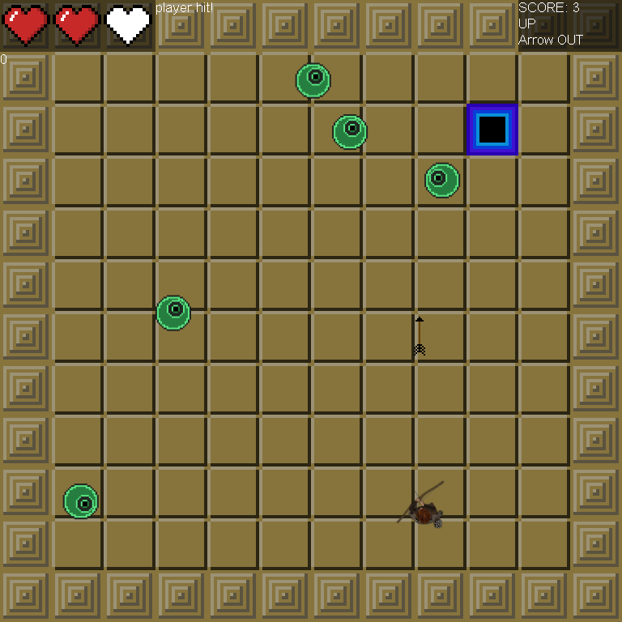

# Little Rogue



## Description

Little Rogue is a small top down game I made to introduce myself to the Gosu library for Ruby and the difficult challenges that game development presents.

## Primary technologies used
* Ruby
* Gosu library

## Prerequisites
* [Git](https://git-scm.com/)
* [Ruby](https://www.ruby-lang.org/en/downloads/)
* [Homebrew](https://brew.sh/)

## Setup/Installation
* Clone the repository from github
```
$ git clone https://github.com/Umitosan/lil_rogue
```
* (OSX) install graphics and audio dependencies
```
$ brew install sdl2 libogg libvorbis
```
* (Windows) follow the instructions found here:
https://github.com/gosu/gosu/wiki/Getting-Started-on-Windows
* install the Gosu Gem
```
$ gem install Gosu
```
* navigate to the repo folder run the game
```
$ ruby game.rb
```

## Known Bugs
* N/A

## License
*open source GPL & MIT*
```
Copyright (c) 2017 **Dominic Brown**
```
